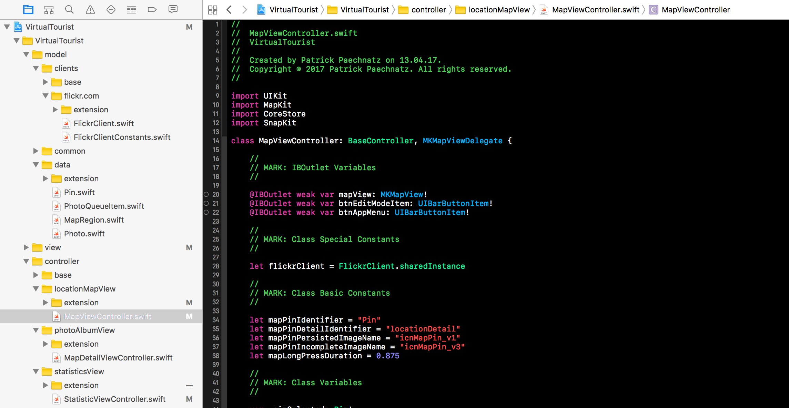
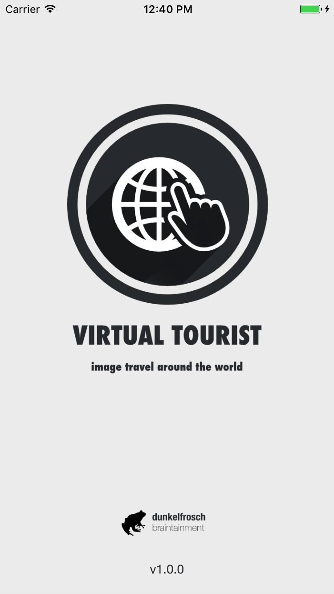
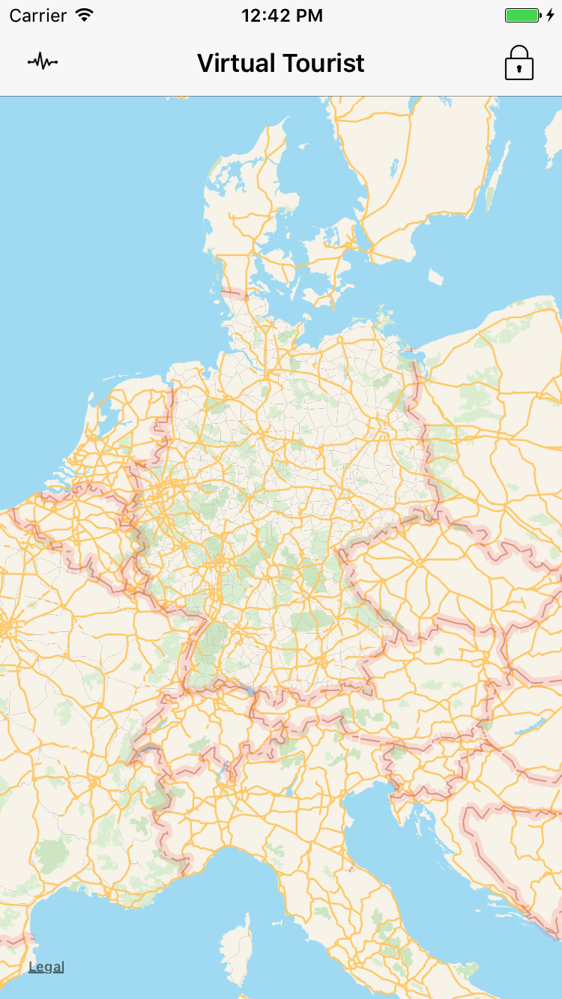
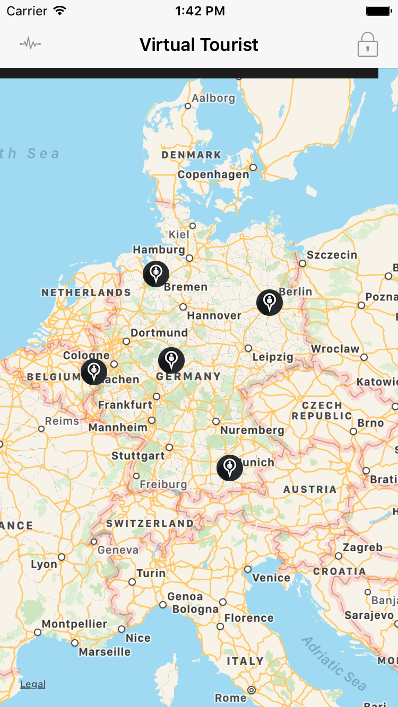
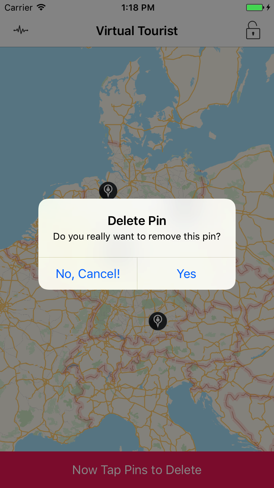
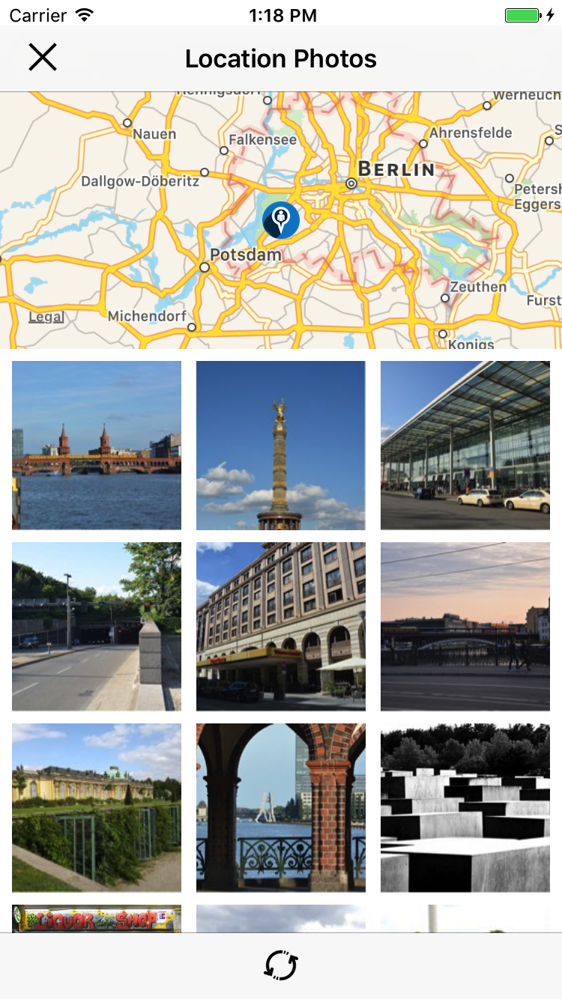
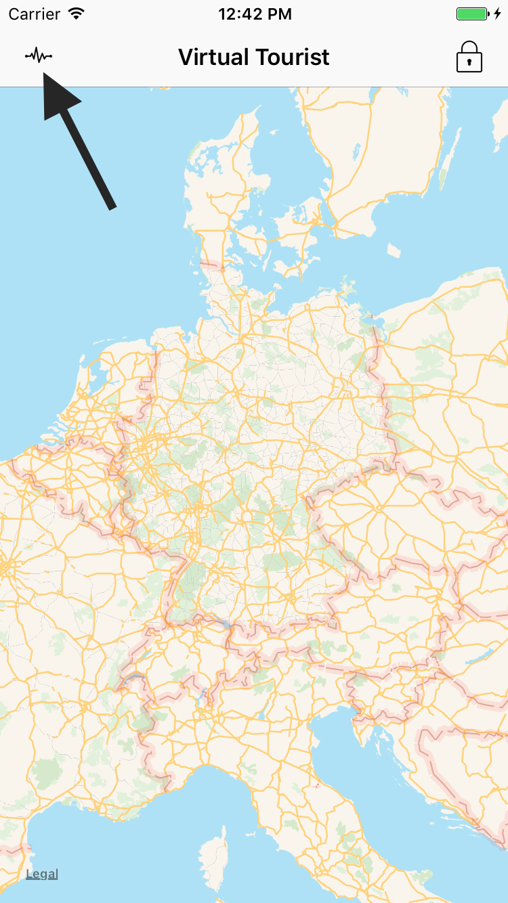
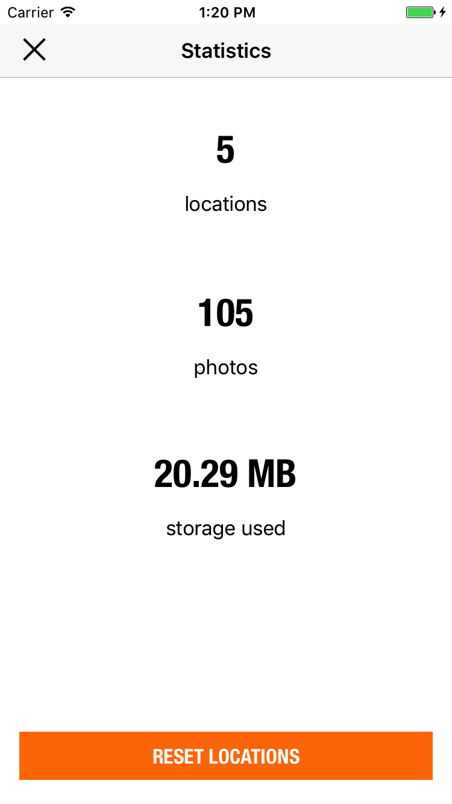

# VIRTUAL-TOURIST
## udacity.com student submission

[](LICENSE)
[](COURSE)
[](VERSION)
[](http://swift.org)

*This repository contains the project submission for udacity.com project work "VirtualTourist" during my iOS developer certification program (course ND003).*

## App Description

„Virtual Tourist“ (VT) is an iOS 10.3 mobile app that allows users to pin any location on the map and automatically fetch corresponding photos of this location from the flickr.com api. The user can refresh the generated photo collection (fully or parts of it) anytime from inside the collectionView. The user can also delete existing locations from the map and take a look into stats like used space, amount of photos and locations.

## App Specifications

VT master (currently 1.0.0) was created using the latest XCode 8.3.3 (8E3004b) version and will be able to run under iOS version 9.n up to the latest iOS version 10.3.3. 

VT master is using POD composition technics to handle 3rd party dependencies. You have to install [POD](https://guides.cocoapods.org/using/getting-started.html) 
and run ```pod install``` before starting the app inside/as your xcode workspace.

VT uses one (1) APi endpoint (flickr.com:flickr.photos.search) by using iOS’ native http session handler abstraction.

VT uses 3rd Party Libraries for better UX/UI behavior and graphical elements from icons8. A complete list of used libraries and assets can be found inside the projects [COPYRIGHT.md](COPYRIGHT.md) file.

## App Features

VT uses some additional features. The app uses a dedicated process pipe for fetching api results and downloading media data from it. VT provides some basic statistics for used space and the number of photos/locations and helps users to reset previously set locations (including photos) with one click.

## App Structure

VirtualTourist is following the MVC pattern by structural and logical definition. The app is using dedicated view partials instead of base sub views of collection cells and annotations.

 

### AppStart
*after starting the app and the launch screen disapears a simple mapView will be shown and you can start to pin down your favorite locations*

Splash Screen | MapView
:-------------------------:|:-------------------------:
  |  

### MapView
*Each map point (pin) can be generated by a single longpress tap on any map location. After a user interaction(the tap) is confirmed, the download process of the corresponding photos will be started and run in the application background acompanied by a download progress bar. You can delete created pins anytime by clicking the unlock icon on the top right of application and afterwards tapping the pin you want to remove*

MapView (with pins) | MapView (pin delete mode)
:-------------------------:|:-------------------------:
  |  

### CollectionView
*After the download of location photos is completed you can visit the photo collection by tapping the pin. Within this view you can reload the complete photostack for this location or just delete some of the photos by tapping and clicking the refresh icon on the bottom part of this app.*

MapView (with pins) | MapView (pin delete mode)
:-------------------------:|:-------------------------:
  |  

### StatisticsView
*You can take a look of your current virtual touristic journey statistics by clicking the upper left icon in mapView. Here you can find some useful information about currently persisted pins, photos and the total space used by your currently photo stack*

Statistic Icon | StatisticView
:-------------------------:|:-------------------------:
 | 


## Keywords
swift, swift-3, udacity, extension, uikit, foundation, app

## Releases

VirtualTourist is currently available in [2 releases](https://github.com/paterik/udacity-ios-virtual-tourist/releases) and will be following the sequence-based semantic version pattern _major.minor[.maintenance[.build]]_.

## Changelog

All notable changes of the VirtualTourist release series are documented in project [CHANGELOG.md](CHANGELOG.md) file using the [Keep a CHANGELOG](http://keepachangelog.com/) principles. The changelog documentation starts with version 0.9.9 (2017-04-13).

## License-Term

Copyright (c) 2017 Patrick Paechnatz <patrick.paechnatz@gmail.com>
                                                                           
Permission is hereby granted,  free of charge,  to any  person obtaining a copy of this software and associated documentation files (the "Software"), to deal in the Software without restriction,  including without limitation the rights to use,  copy, modify, merge, publish,  distribute, sublicense, and/or sell copies  of the  Software,  and to permit  persons to whom  the Software is furnished to do so, subject to the following conditions:       
                                                                           
The above copyright notice and this permission notice shall be included in all copies or substantial portions of the Software.
                                                                           
THE SOFTWARE IS PROVIDED "AS IS", WITHOUT WARRANTY OF ANY KIND, EXPRESS OR IMPLIED, INCLUDING  BUT NOT  LIMITED TO THE WARRANTIES OF MERCHANTABILITY, FITNESS FOR A PARTICULAR  PURPOSE AND  NONINFRINGEMENT.  IN NO EVENT SHALL THE AUTHORS OR COPYRIGHT HOLDERS BE LIABLE FOR ANY CLAIM, DAMAGES OR OTHER LIABILITY,  WHETHER IN AN ACTION OF CONTRACT,  TORT OR OTHERWISE,  ARISING FROM,  OUT OF  OR IN CONNECTION  WITH THE  SOFTWARE  OR THE  USE OR  OTHER DEALINGS IN THE SOFTWARE.
